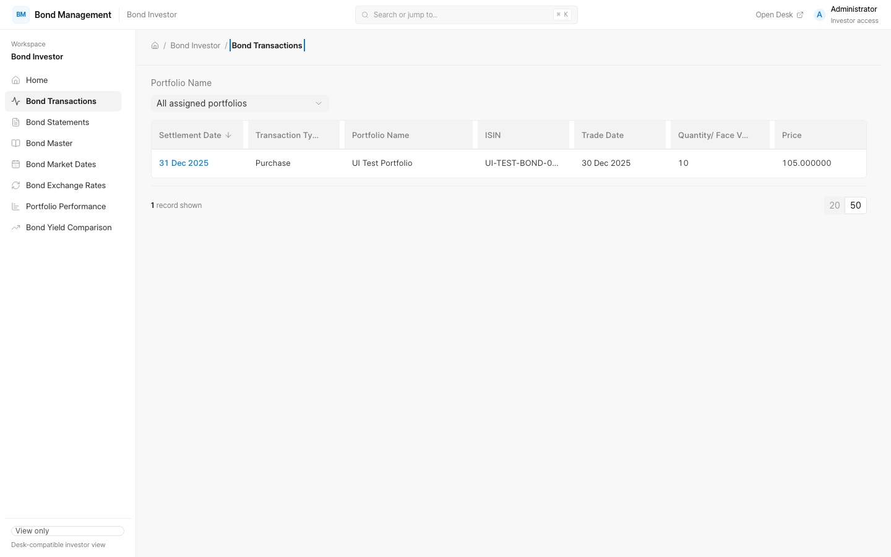
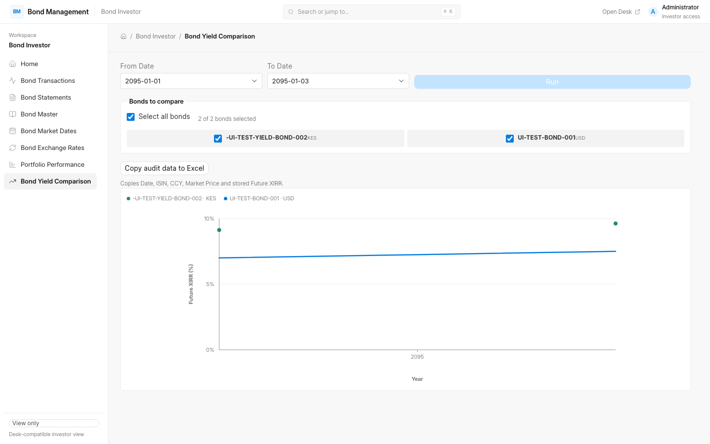

# Bond Management

Bond Management is a Frappe Framework v16 application for managing fixed-income portfolios from bond setup through transaction capture, statement reconciliation, market data, and performance reporting.

It provides two complementary experiences:

- An internal Desk workspace for maintaining bond, portfolio, transaction, statement, market-data, and exchange-rate records.
- A responsive, read-only investor application at `/bond-investor` for permission-scoped portfolio data and reports.

Financial calculations and permissions are enforced on the server. Uploaded statements and transaction documents remain private.

## What the app does

| Area | Capabilities | Main records or reports |
| --- | --- | --- |
| Reference data | Define bonds, coupon schedules, principal repayments, day-count conventions, currencies, withholding tax, and quantity-change rules. | Bond Master, Bond Coupon Schedule, Bond Principal Schedule |
| Portfolio operations | Store portfolio and account details and associate users with the portfolios they are allowed to see. | Bond Portfolio |
| Transactions | Record purchases and sales manually or extract transaction data from private PDF attachments. Validate dates, prices, accrued interest, commissions, and ledger consistency. | Bond Transaction |
| Statements | Extract statement identity, holdings, prices, and exchange rates from private PDFs; reconcile statement quantities with calculated portfolio positions; generate a reconciliation report. | Bond Statement, Bond Statement Details |
| Market data | Maintain dated market prices, principal factors, weighted repayment dates, future XIRR values, and yield-curve data. | Bond Market Date, Bond Market Prices |
| Exchange rates | Store statement-sourced and manually maintained currency rates, including reverse rates. | Bond Exchange Rate |
| Analytics | Review portfolio value, proceeds, gains, past and future XIRR, and historical stored bond yields. | Portfolio Performance, Bond Yield Comparison |

The normal operating flow is:

```text
Bond and portfolio setup
            ↓
Transaction and statement capture
            ↓
Reconciliation and market-data maintenance
            ↓
Portfolio performance and yield analysis
            ↓
Permission-scoped investor view
```

## Investor application

The investor application is a Vue 3, TypeScript, and Frappe UI frontend served from the same Frappe session. It is intentionally read-only: users can browse and analyze data but cannot create, edit, delete, or upload financial records from this surface.

Available investor surfaces:

- Bond Transactions: sortable, filterable transaction lists and read-only details.
- Bond Statements: statement history, reconciliation status, holdings, and permitted document downloads.
- Bond Master: bond terms and generated coupon/principal schedules.
- Bond Market Dates: dated market prices and yield-curve details.
- Bond Exchange Rates: dated currency-rate history.
- Portfolio Performance: valuation-date portfolio values, gains, native/reporting-currency XIRR, and copyable cash flows.
- Bond Yield Comparison: date-range comparison of persisted Future XIRR values with currency-aware chart series and audit-data export.

Access is controlled by the existing Frappe roles and portfolio permissions:

- `Bond Investor Read Only` users see only portfolios assigned through Frappe User Permission records.
- `Bond Management Manager` users and `Administrator` can use the investor application for support and review while retaining internal Desk access.
- Other users and guests are denied access to the investor application and its APIs.

### Screenshots

These screenshots use synthetic records from the local `test_site`; they do not contain production or real investor data.





## Internal Desk workspace

Internal users work from the **Bond Investor** workspace at `/desk/bond-investor`. It contains shortcuts to the operational records and reports:

- Bond Transactions
- Bond Statements
- Bond Master
- Bond Market Dates
- Bond Exchange Rates
- Portfolio Performance
- Bond Yield Comparison

The Desk workflow remains the source for financial mutations, attachment parsing, reconciliation, and market-data maintenance. The investor application presents the server-authoritative result of those workflows.

## Installation

### Requirements

- Frappe Framework v16
- Python 3.14
- Node.js 24
- MariaDB 11.8 or 12.3
- Redis 6 or newer

Install the app from the bench directory:

```bash
cd /path/to/frappe-bench
bench get-app <repository-url> --branch version-16
bench --site <site-name> install-app bond_management
bench --site <site-name> migrate
bench build --app bond_management
```

Enable the investor application for a site when it is ready for pilot use:

```bash
bench --site <site-name> set-config bond_investor_spa_enabled 1
```

Assign the appropriate roles and create portfolio-scoped User Permission records before giving investors access. The Desk workspace remains available at `/desk/bond-investor` during the SPA rollout.

## Development

From the app directory:

```bash
cd apps/bond_management
yarn install
yarn build
yarn lint
yarn typecheck
```

The frontend source is under [`frontend/`](frontend/). The Python controllers, reports, APIs, utilities, DocTypes, and tests are under [`bond_management/bond_management/`](bond_management/bond_management/).

For local Frappe development, use `dev.local` for interactive work and `test_site` for automated tests. The frontend dev server can be started with:

```bash
yarn dev
```

## Verification

The repository has shared verification gates for formatting, linting, server tests, Desk tests, and investor UI tests. Run them from the bench directory:

```bash
apps/bond_management/scripts/verify.sh pre-push
```

For changes affecting JavaScript, reports, DocType metadata, workspaces, or other Desk behavior, also run:

```bash
apps/bond_management/scripts/verify.sh pre-push-ui
```

See [`docs/verification.md`](docs/verification.md) for the required gates, test-site rules, Cypress runtime recovery, and completion evidence format.

## Design and security principles

- Server-side calculations are authoritative; the browser formats and presents returned values.
- Monetary values, yields, accrued interest, and quantities use decimal-safe financial calculations with explicit rounding at business boundaries.
- Settlement dates, coupon schedules, principal repayments, market-price conventions, and cash-flow signs follow the app's bond rules.
- Financial PDFs are read through Frappe's private File APIs and are never exposed through public or guest access.
- Investor API responses use fixed, permission-scoped projections rather than unrestricted generic DocType access.
- Generated statement reports and derived exchange-rate or market-price data are kept tied to their owning statement and handled idempotently.

More implementation context is documented in [`ARCHITECTURE_SPEC.md`](ARCHITECTURE_SPEC.md).

## License

MIT. See [`license.txt`](license.txt).
