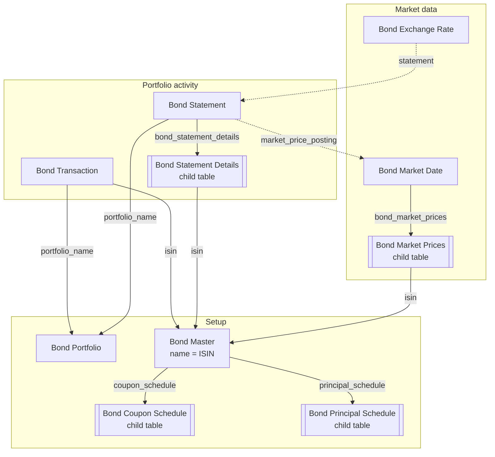
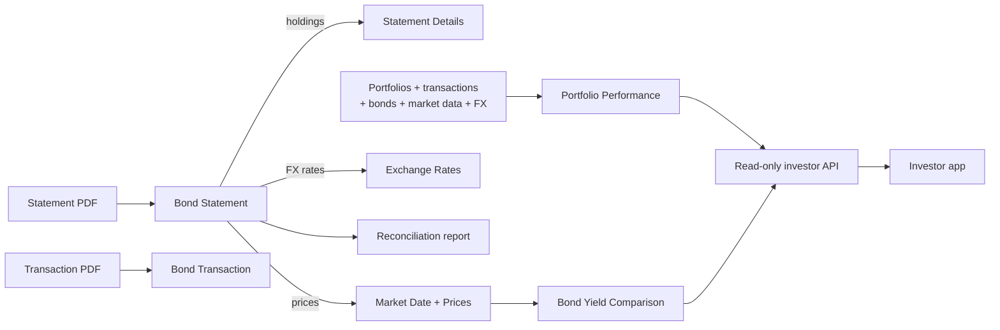

# Bond Management domain model

This is a source-derived map of the current app, not a proposed schema. The app
has six standalone DocTypes and four child-table DocTypes.

## How to read the graphs

- An edge label is the field that creates the relationship.
- Solid edges are ordinary `Link` or `Table` relationships.
- Dotted edges are persisted links maintained by server code.
- Child tables have Frappe's implicit `parent`, `parenttype`, and `parentfield`
  fields.

## DocType relationships

`Bond Master` and `Bond Exchange Rate` also link to Frappe's `Currency`
DocType. Statement and transaction attachments use private Frappe `File`
records; those framework relationships are omitted above to keep the domain
graph focused.

## Main processing flow

Desk owns financial writes. The investor app reads fixed, permission-scoped API
projections.

## Important behavior

- `Bond Transaction` is the portfolio ledger.
- Saving a `Bond Statement` derives holdings, market prices, exchange rates,
  reconciliation status, and a private reconciliation report.
- A statement-derived exchange rate links back to its statement; a manual rate
  does not.
- Portfolio performance combines all core financial data. Yield comparison
  reads persisted market snapshots.

## Source anchors

- [DocType metadata](../bond_management/bond_management/doctype/)
- [Statement-derived data](../bond_management/bond_management/doctype/bond_statement/bond_statement.py)
- [Performance inputs](../bond_management/bond_management/utils/performance.py)
- [Investor API](../bond_management/bond_management/api/investor.py)
