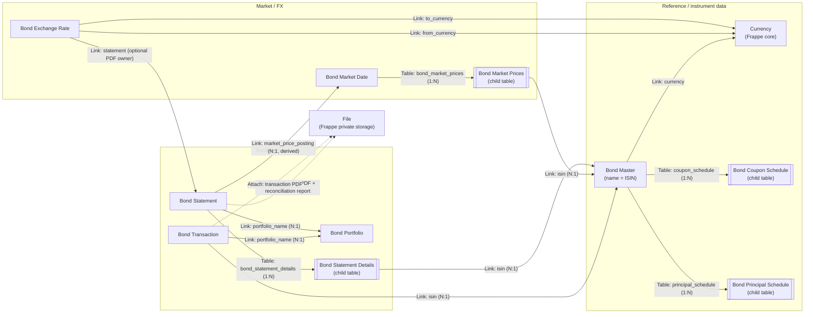
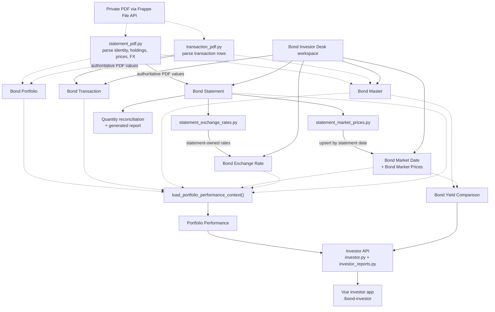

# Bond Management domain model

This document maps the current persisted DocType relationships and the main
runtime dependencies between capture, derived data, analytics, and user-facing
surfaces. It is source-derived rather than a proposed schema: update it when
DocType metadata or relationship-owning services change.

## Legend

- Solid edges represent persisted `Link` or `Table` relationships.
- Dotted edges represent runtime reads, derived writes, or service dependencies.
- Frappe child tables also carry the implicit `parent`, `parenttype`, and
  `parentfield` relationship fields.

## DocType relationships

## Runtime and reporting dependencies

## Relationship notes

- `Bond Master` is the reference hub. Its name is the ISIN, and it owns coupon
  and principal schedules as child tables.
- `Bond Transaction` is the portfolio ledger. Each transaction links one bond
  to one portfolio.
- `Bond Statement` is the ingestion and reconciliation hub. Saving a statement
  can populate statement-detail rows, update the market snapshot for its date,
  synchronize statement-owned exchange rates, and generate a private
  reconciliation report.
- `Bond Market Prices` and `Bond Statement Details` each link their row to a
  `Bond Master` in addition to belonging to their respective parent table.
- `Bond Exchange Rate.statement` is optional: statement-derived rates point
  back to their owning statement, while manually maintained rates do not.
- Portfolio performance reads transactions, bond terms and schedules, market
  prices, and exchange rates. Yield comparison reads persisted market-date
  snapshots and filters them through readable `Bond Master` records.
- The investor application is read-only and receives fixed projections through
  the investor API; financial mutations remain in Desk workflows.

## Source anchors

- [DocType metadata](../bond_management/bond_management/doctype/)
- [Bond Statement controller](../bond_management/bond_management/doctype/bond_statement/bond_statement.py)
- [Market-price synchronization](../bond_management/bond_management/utils/statement_market_prices.py)
- [Exchange-rate synchronization](../bond_management/bond_management/utils/statement_exchange_rates.py)
- [Performance context](../bond_management/bond_management/utils/performance.py)
- [Investor API](../bond_management/bond_management/api/investor.py)
